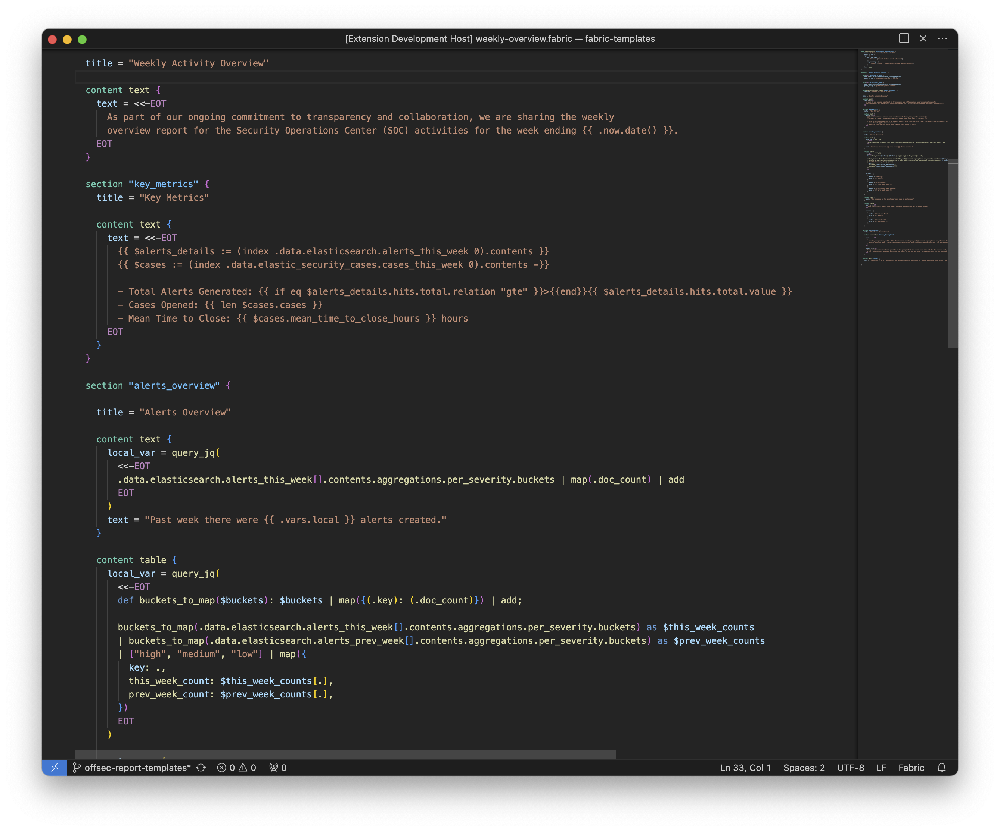

# Fabric Extension for Visual Studio Code

This extension adds syntax highlighting for [Fabric](https://github.com/blackstork-io/fabric) template files written in [FCL](https://blackstork.io/fabric/docs/language/).

## Quick Start

To start writing Fabric templates with VSCode:

1. Install Fabric. See [documentation](https://blackstork.io/fabric/docs/install/) for the details.
2. Install the Fabric Extension for VSCode.
3. Open existing or new `*.fabric` file and verify that the language indicator in the bottom right corner of the window is set to `Fabric`.

## Features

### Syntax Highlighting

Fabric syntax highlighting recognizes language constructs like configurations, data and content blocks, attributes, etc.

## Installation

To start using the extension with Visual Studio Code, copy it into the `<user home>/.vscode/extensions` folder and restart Code.

## Requirements

- VSCode v1.86 or greater

## Troubleshooting

- If you find a bug or a problem with the extension, please create a [new issue](https://github.com/blackstork-io/vscode-fabric/issues/new/choose). 
- If you have questions about the extension, please post a message in [Fabric Community Slack](https://fabric-community.slack.com/)

Contributions are always welcome!

## References

The extension is inspired by [vscode-terraform](https://github.com/hashicorp/vscode-terraform) and [vscode-hcl](https://github.com/hashicorp/vscode-hcl).
